# Microsoft Azure AD

1. Acesse Portal da Azure [https://portal.azure.com/](https://portal.azure.com)
2. Esta documentação foi escrita utilizando Azure com a linguagem Inglês, caso ache necessário e sua linguagem esteja configurada diferente no Azure, altere a linguagem do seu Azure para o inglês, para facilitar a compreensão dos passos.

### Criando Aplicativo Desko no Portal Azure

1. Clique em **Active Directory** do Azure

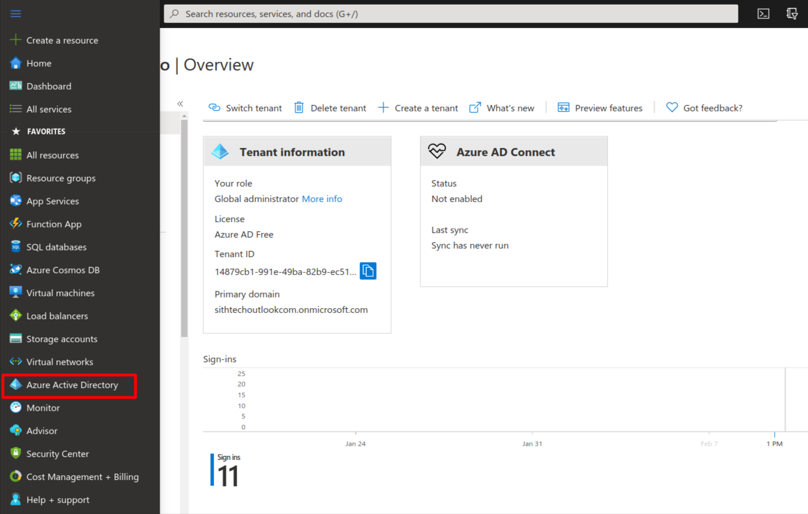

1. Clique em **Enterprise Applications**

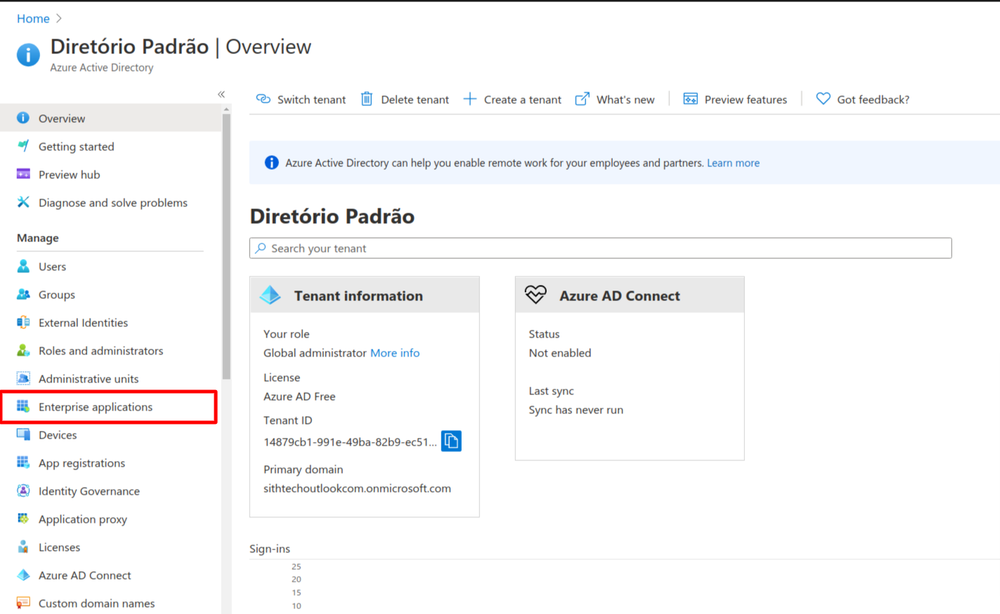

1. Clique em **Create Our Own Application**

1. Informe um nome para o Aplicativo e escolha a opção **Integrate any other application you don't find in the gallery (Non-gallery)**

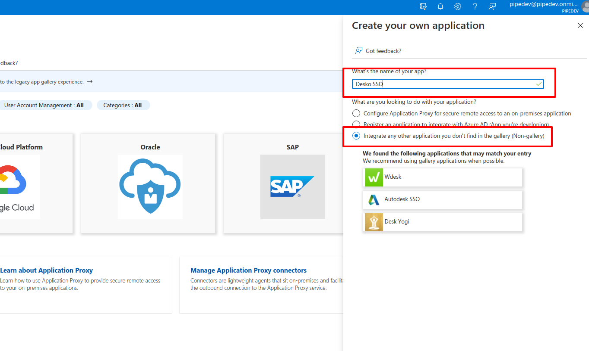

### Atribuindo Usuários Grupos ao Aplicativo

1. Atribua os usuários ou grupos que terão acesso ao aplicativo (pelo menos o seu usuário ou de algum para que possamos realizar o teste ao final deste passo a passo)

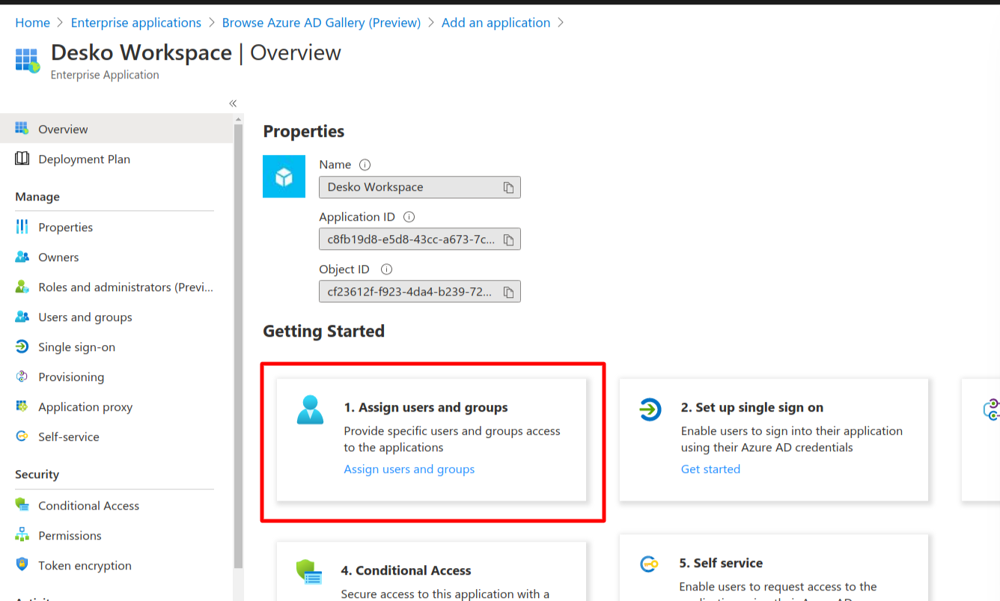

1. Após a atribuição de Usuários, clique no Menu em Single sign-on para iniciarmos as configurações.

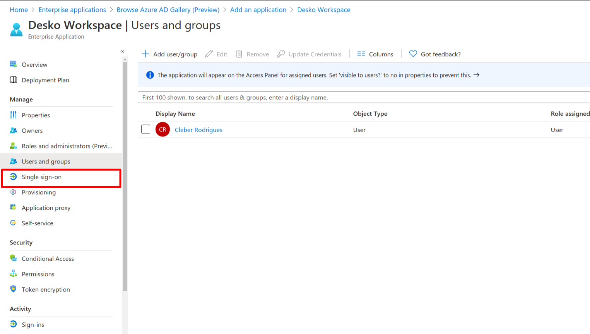

### Configurando Autenticação

Neste ponto você deverá acessar o Painel Desko ([https://painel.desko.com.br](https://painel.desko.com.br)), utilizando um usuário e senha que lhe foi fornecido, pois será necessário realizar a troca de URLs e certificados entre o Provedor de Identidade (Azure AD) e o Provedor de Serviço (Desko)

1. Acesse o Painel Desko ([https://painel.desko.com.br](https://painel.desko.com.br))

1. Acesse o Menu Integrações / Autenticações.

O Acesso de Integrações / Autenticação é restrito aos Perfis TI e Super Usuários, verifique com o administrador se sua conta faz parte de um destes perfis.

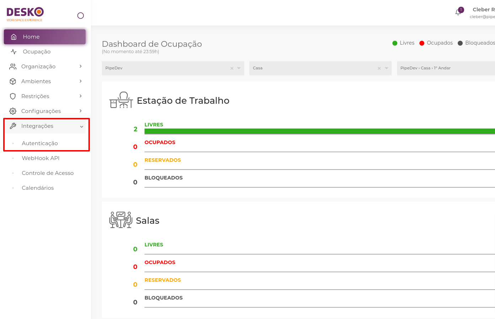

1. Habilite a Autenticação SAML SSO

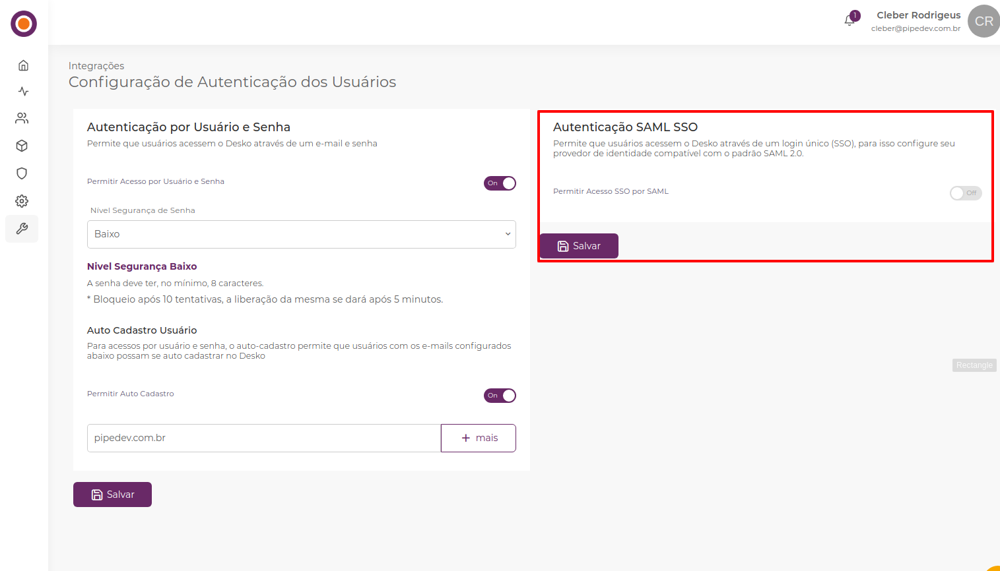

1. Informe um nome para a sua conexão

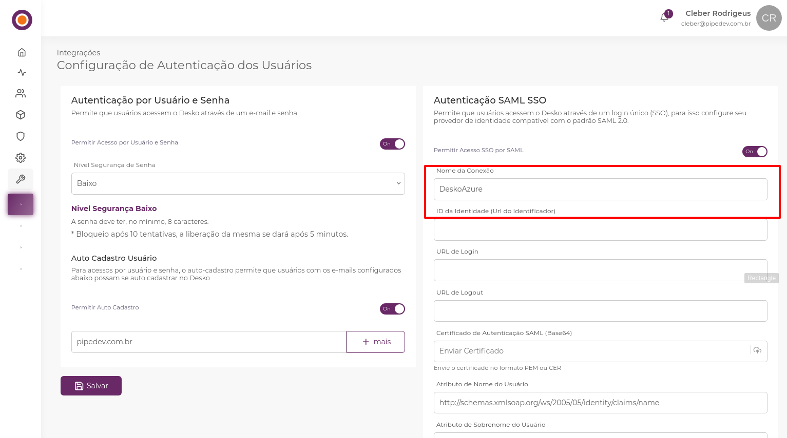

1. Copie as URL de Configuração do Desko

No Painel do Desko em Configuração Básica de SAML, copie as urls existentes no seu Painel, as mesas deverão ser informadas no Portal Azure.

**Esta imagem abaixo é apenas ilustrativa, verifique no PAINEL Desko as urls referentes a sua conta. Cada conta possui a sua URL específica**

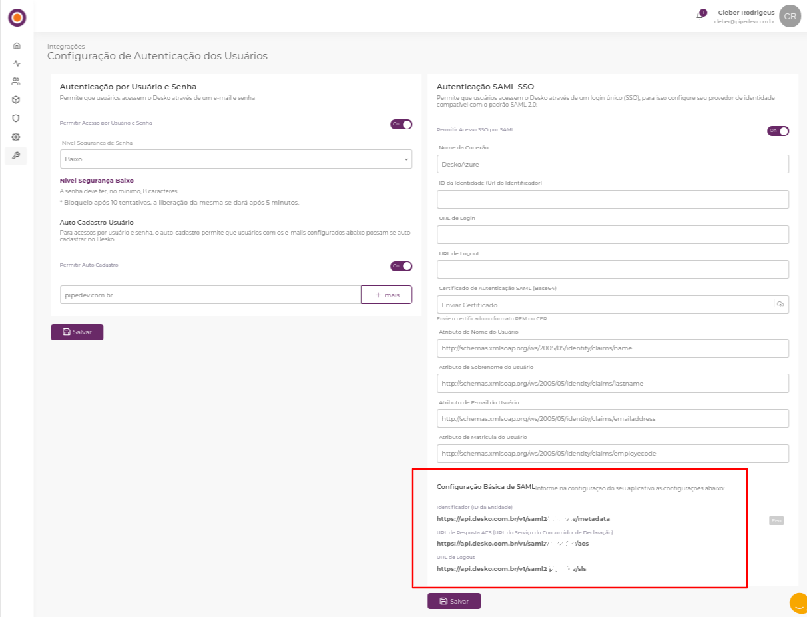

1. Acesse novamente seu Portal Azure, no Menu Single sign-on > SMAL

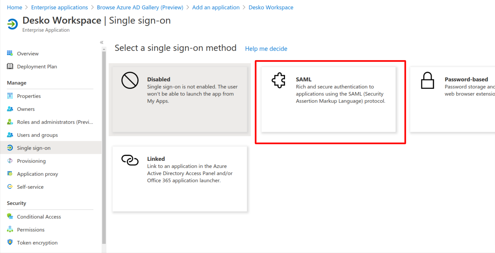

1. Será exibido as informações de configuração do SAML.\
   No Item ( 1 ) **Basic SAML Configuration**, clique em **Edit**.

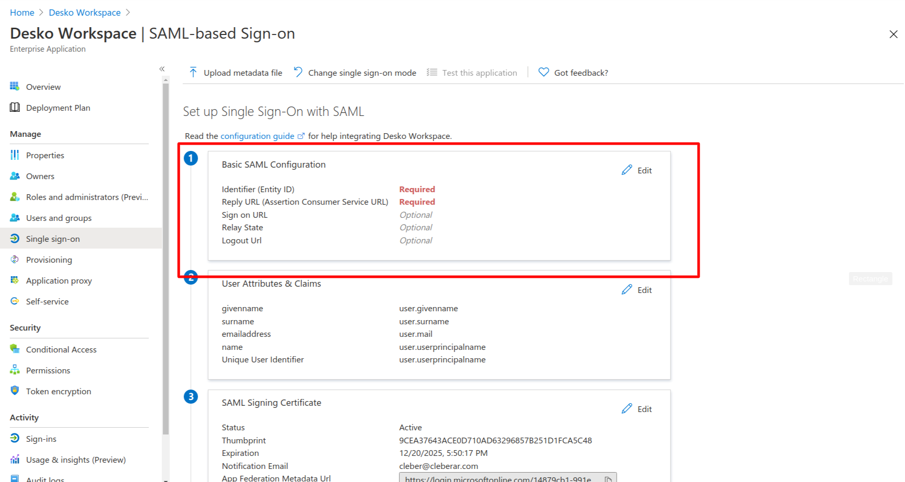

1. Volte ao Painel Desko e copie as urls disponíveis em Configuração Básica de SMAL no Painel Desko nos campos correspondentes do Item Basic SAML Configuration do Portal Azure.

Urls do Painel Desko que correspondem as urls do Portal Azure

| **Painel Desko**                                                           | **Portal Azure**                                                       |
| -------------------------------------------------------------------------- | ---------------------------------------------------------------------- |
| Identificador (ID da Entidade)                                             | Identificador (ID da Entidade)                                         |
| 
URL de Resposta ACS (URL do Serviço do Consumidor de Declaração)
 | 
URL de Resposta (URL do Serviço do Consumidor de Declaração)
 |

Caso exista alguma url já pré-configurada no Portal Azure substitua pela url do Desko.

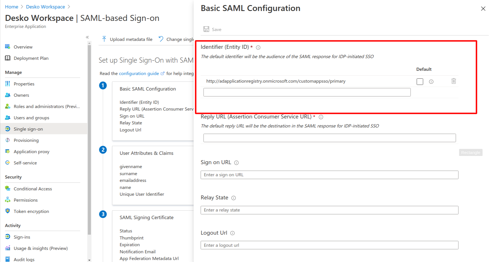

1. Clique em **Salvar**
2. Configure os Attributos (Claims), Clique em **Edit** no Item (2) **USer Attributes & Claims**

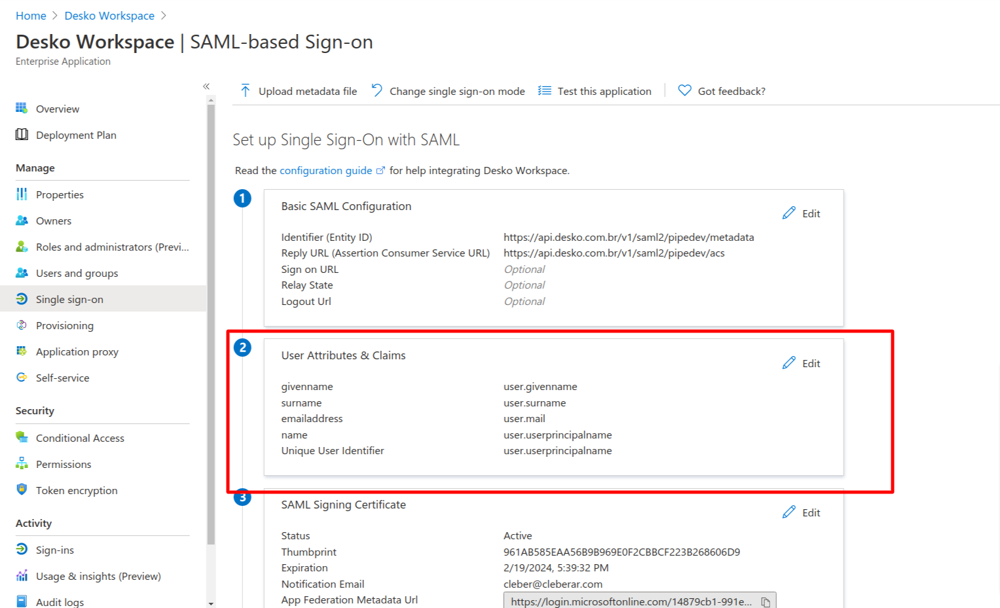

1. Será exibida a lista de Claims disponíveis, Clique sobre o item **Value** do Claim name **Unique User Identifier (Name ID)**

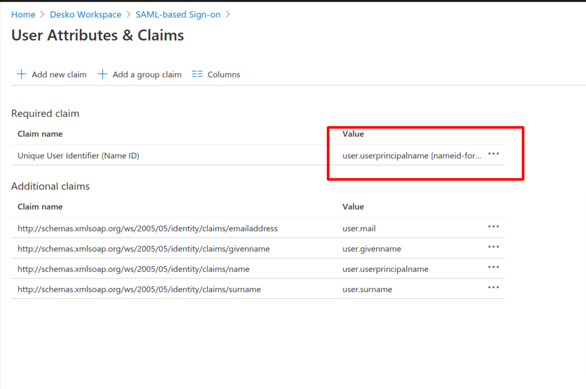

1. Clique no Item “Choose name identifier Format” e selecione “**PERSISTENT**”

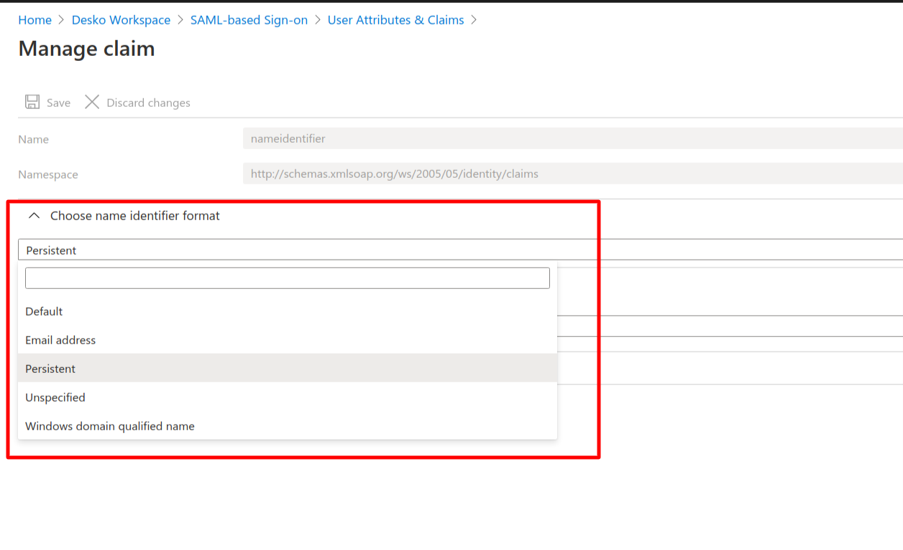

1. Clique em **Source attribute** e selecione user.mail

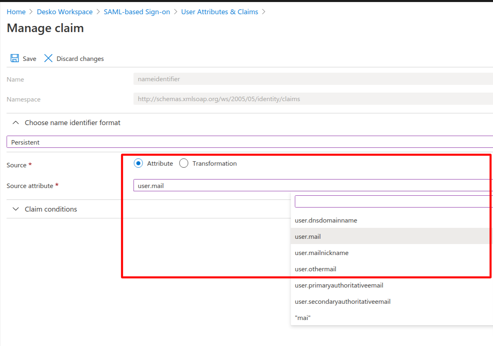

1. Clique em **Save** após no X para fechar esta configuração

1. Verifique se em **Additional claims**, existe os claims emailaddress e name correspondendo às informações Abaixo:

| **Claim name**                                                     | **Value**        |
| ------------------------------------------------------------------ | ---------------- |
| http://schemas.xmlsoap.org/ws/2005/05/identity/claims/emailaddress | user.mail        |
| http://schemas.xmlsoap.org/ws/2005/05/identity/claims/name         | user.displayname |

Para Integração com Azure outros atributos/claims podem ser ignorados.

1. **CONFIRA OS CLAIMS**: Esta é a configuração final de atributos /claims para o funcionamento com o DESKO

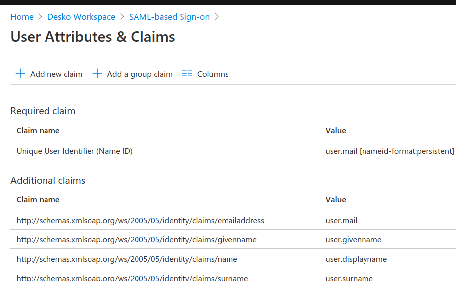

1. Certificado. No Portal Azure faça o Download do certificado no formato Base64 no item (3) **SMAL Signing Certificate.**
2. Volte ao Painel Desko, Clique no Campo Certificado de Autenticação SAML (Base64), será aberto a janela de escolha de arquivo, selecione o certificado baixado e faça o upload.

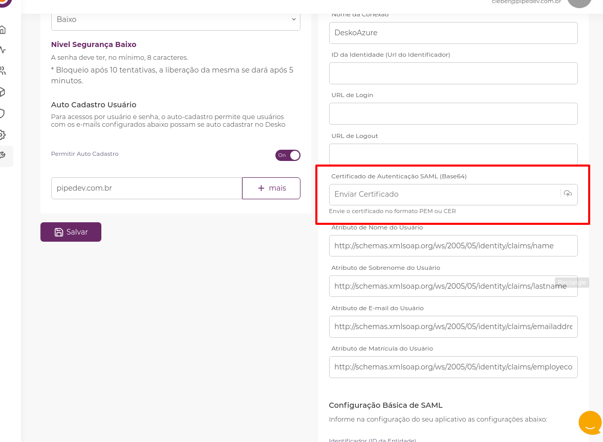

1. Configurando as Urls do Azure no Desko.

Volte ao Portal Azure no Item (4) as Urls Login URL e Azure AD Identifier devem ser adicionadas no Painel Desko.

1. Copie as urls nos Campos correspondentes do Painel Desko

##

Verifique abaixo os campos das Urls do Portal Azure e qual Campo corresponde ao Painel Desko

| **Campo da Azure**  | **Campo do Painel Desko**               |
| ------------------- | --------------------------------------- |
| Azure AD Identifier | ID da Identidade (Url do Identificador) |
| Login URL           | URL de Login                            |
| Logout URL          | URL de Logout                           |

1. Lembre-se de Salvar as Configurações no Painel Desko CLICANDO EM **SALVAR**
2. Pronto basta acessar seu app do Desko **\<nomedaempresa>.desko.com.br** e clicar no Botao que você nomeou para login
3. **Seja Feliz :)**

### Erros e Soluções:

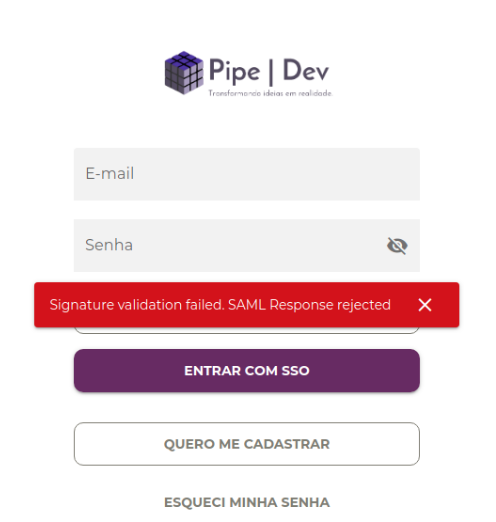

Caso este erro “Signature validation failed. SAML Response rejected” ocorra, faça os seguintes procedimentos.

1 - Painel Desko: Faça novamente o upload o certificado no Painel Desko;

2 - Portal Azure: Clique em Editar em User Attributes & Claims.

Verifique se o Identificador Exclusivo do Usuário possui o valor\*\*: user.mail \[nameid-format:persistent]\*\*

**Versionamento**

| **Versão** | **Author**                     | **Data**   |
| ---------- | ------------------------------ | ---------- |
| v1.5       | Cleber Rodrigues               | 03/08/2021 |
| v1.4       | Cleber Rodrigues               | 19/02/2021 |
| v1.3       | Cleber Rodrigues e Mário Verdi | 03/02/2021 |
| v1.2       | Cleber Rodrigues               | 08/10/2020 |
| v1.1       | Cleber Rodrigues               | 15/09/2020 |
| v1.0       | Mário Verdi                    | 13/09/2020 |
