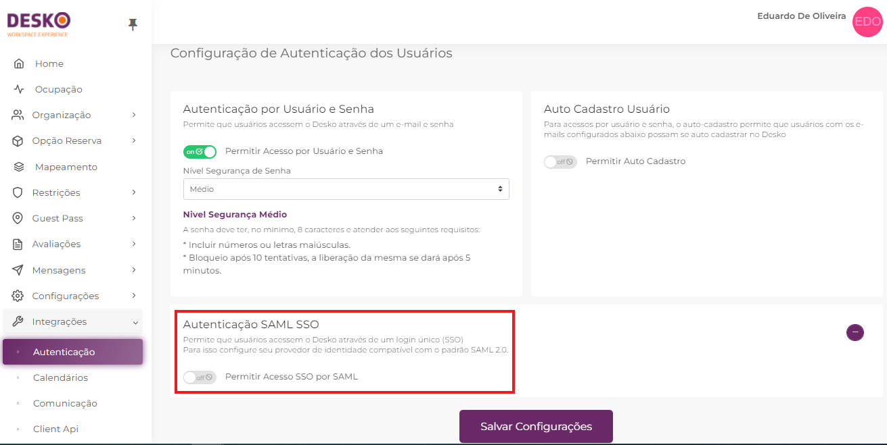
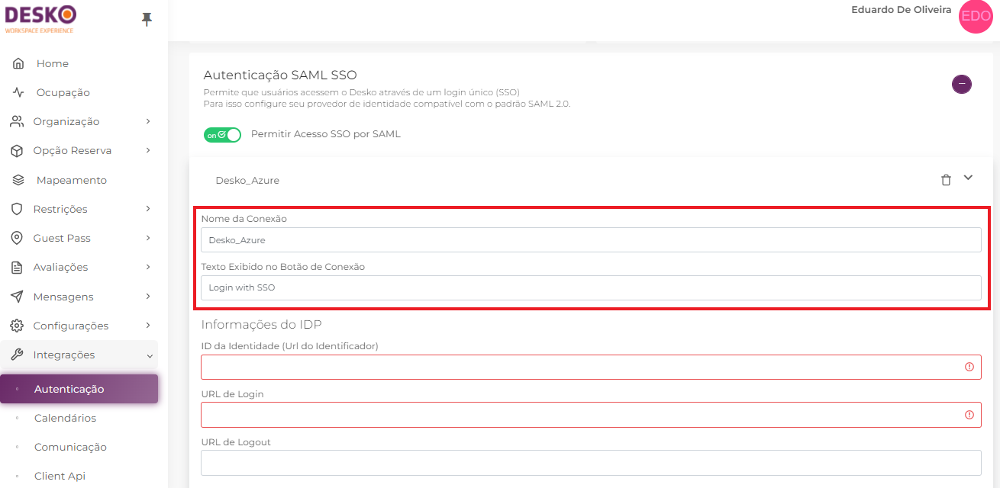
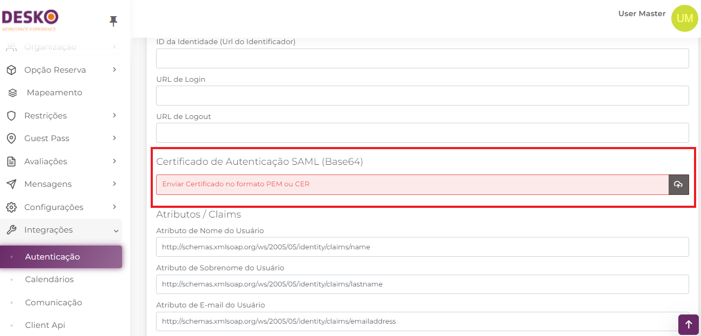
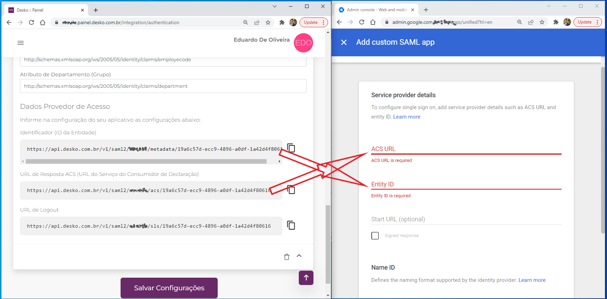
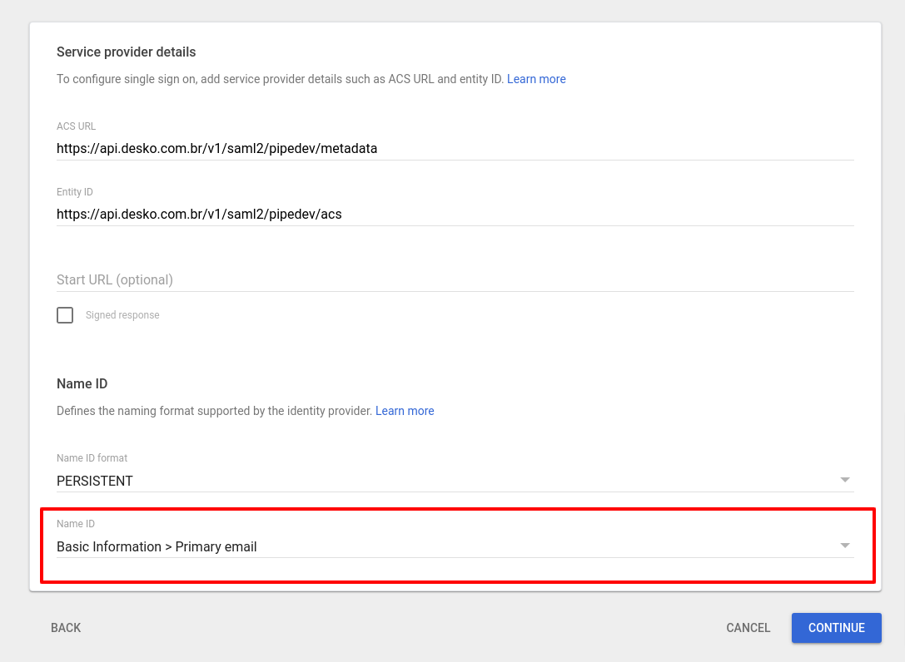
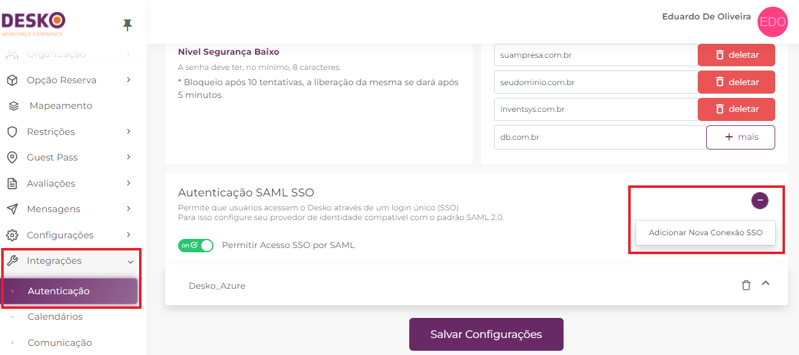

# Google Workspace (G-Suite)

1. Acesse Admin Console [https://admin.google.com](https://admin.google.com/ac/home?hl=en-US)

2\. Esta documentação foi escrita utilizando Google Admin com a linguagem Inglês, caso ache necessário e sua linguagem esteja configurada diferente no Google Admin, altere a linguagem do seu Google para o inglês, para facilitar a compreensão dos passos.

## Criando Aplicativo Desko no Admin do Google

3\. Clique em **Apps**

.png>)

4\. Clique em **Web and Mobile Apps**

.png>)

5\. Clique em **Add App**, após em **Add custom SAML app**

.png>)

6\. Informe o Nome do seu App e Clique em **Continue**

.png>)

7\. Nesta etapa será exibido os dados de acesso por parte do Google, você deverá acessar o Painel Desko [https://\<nomedaempresa>.painel.desko.com.br](https://\<nomedaempresa>.painel.desko.com.br), utilizando um usuário e senha que lhe foi fornecido, pois será necessário realizar a troca de URLs e certificados entre o Provedor de Identidade (Google) e o Provedor de Serviço (Desko)

8\. Dados de Acesso do SSO do Google

9\. Acesse o Painel Desko [https://\<nomedaempresa>.painel.desko.com.br](https://\<nomedaempresa>.painel.desko.com.br)

10\. Acesse o Menu **Integrações** / **Autenticações**.

O Acesso de Integrações / Autenticação é restrito aos Perfis TI e Super Usuários, verifique com o administrador se sua conta faz parte de um destes perfis.

.png>)

11\. Habilite a **Autenticação SAML SSO**\
****

\

12\. Informe um nome para a sua conexão e como deseja o texto para o botão de conexão na tela inicial\

\

13\. Volte ao Google e copie as Urls fornecidas pelo Google no Painel Desko conforme demonstrado abaixo.

.png>)

Campos do Google Equivalentes ao Campo no Painel Desko

| **Campo do Google** | **Campo do Painel Desko**               |
| ------------------- | --------------------------------------- |
| Entity ID           | ID da Identidade (Url do Identificador) |
| SSO URL             | URL de Login                            |

14\. No Google Admin, faça o download do certificado clicando no botão de _download_\

.png>)

15\. Volte ao Painel Desko, na seção **Certificado de Autenticação SAML (Base64)**, clique no botão de upload, selecione o certificado baixado e faça o upload\

16\. Após inserir as urls do google no Desko e fazer o upload do Certificado, Volte ao Google e clique em **CONTINUE**\

.png>)

17\. Volte ao Painel Desko, role a página para baixo até a seção **Dados Provedor de Acesso**, copie as URLs do painel Desko e cole no portal Google Admin conforme mostrado abaixo

**NOTA: a imagem abaixo é apenas ilustrativa, verifique no seu painel Desko as URLs referentes a sua conta. Cada conta possui as suas URLs específicas**&#x20;

.png>)

****

18\. As URLs copiadas da seção **Dados Provedor de Acesso** no Painel Desko devem ser adicionadas nos campos correspondentes do Google Admim conforme mostrado abaixo.

**NOTA: a URL de Logout é opcional.**

****

Urls do Painel Desko que correspondem as urls do Google\

| **Painel Desko**                                                           | **Google** |
| -------------------------------------------------------------------------- | ---------- |
| 
Identificador (ID da Entidade)
                                   | Entity ID  |
| 
URL de Resposta ACS (URL do Serviço do Consumidor de Declaração)
 | ACS URL    |

19\. No Campo Name ID Format selecione a opção **PERSISTENT**\

.png>)

20\. Campo Name ID, deve estar selecionada a **Opção Basic Information > Primary email,** e clique em **CONTINUE**\

21\. Clique em **ADD MAPPING** 3 vezes para inserir os 3 atributos de usuários (Claims)\

.png>)

22\. Selecione no Google os 3 campos como **First Name**, **Last Name** e **Primary email,** e insira os atributos conforme demonstrado abaixo\

.png>)

23\. Dados que devem ser inseridos\

| **Google Directory attributes** | **App Attributes**                                                 |
| ------------------------------- | ------------------------------------------------------------------ |
| First Name                      | http://schemas.xmlsoap.org/ws/2005/05/identity/claims/name         |
| Last Name                       | http://schemas.xmlsoap.org/ws/2005/05/identity/claims/lastname     |
| Primary Email                   | http://schemas.xmlsoap.org/ws/2005/05/identity/claims/emailaddress |

\
**NOTA: Para Integração com Google outros atributos/claims podem ser ignorados**\

24\. Clique em **FINISH**\

25\. No Google Admin, lembre de incluir os usuários que terão permissão de acesso à nova aplicação\
\

.png>)

26\. Pronto! Basta acessar seu app do Desko **https://\<nomedaempresa>.desko.com.br** e clicar no botão que você nomeou para login

.png>)

## **Multiplos SSO**&#x20;

A partir da versão 1.78.0 do Desko, é possível configurar mais de um SSO na mesma conta, permitindo que usuários de diferentes domínios possam logar na mesma conta Desko. Para isso, vá no menu **Integrações** è **Autenticação** è na seção **Autenticação SAML SSO** e clique no botão de edição selecionando **Adicionar Nova Conexão SSO** conforme mostrado abaixo

Os demais passos para essa configuração são os mesmos do SSO padrão, volte ao início deste tutorial e siga as instruções normalmente.

**Versionamento**

| **Versão** | **Author**                     | **Data**   |
| ---------- | ------------------------------ | ---------- |
| v1.6       | Eduardo de Oliveira            | 15/02/2022 |
| v1.5       | Cleber Rodrigues               | 12/07/2021 |
| v1.4       | Cleber Rodrigues               | 19/02/2021 |
| v1.3       | Cleber Rodrigues e Mário Verdi | 03/02/2021 |
| v1.2       | Cleber Rodrigues               | 08/10/2020 |
| v1.1       | Cleber Rodrigues               | 15/09/2020 |
| v1.0       | Mário Verdi                    | 13/09/2020 |
