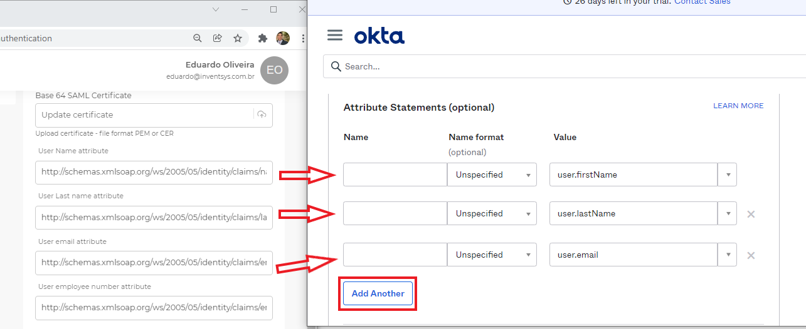

# Okta Identity Platform

### Creating _Desko_ Application on Okta Admin Portal and setting up SSO (SAML 2.0)

&#x20;

1. Access your Okta Admin Console at https://\<YourCompanyName>-admin.okta.com/admin go to **Applications** and click on **Create App Integration**

&#x20;2\.  Choose **SAML 2.0** option and click on **Next**

&#x20;3\.  Enter a name for your application, add a logo (optional) by clicking on the **upload button**, and click on **Next**

**Note:** Before move on to the **SAML settings**, it is necessary to get the _Desko_’s URLs that is going to be inserted into the URL fields in the next step.

4\.  Go to your _Desko_ panel heading over to **https://\<YourCompanyName>.painel.desko.com.br**

**Note: You have to log in using a Master or Admin account.**

5\.  Expand **Integrations** and click on **Authentication**

&#x20;

6\.  Turn on **SSO SAML 2.0 authentication**,

7\.  Go to the bottom of the page at **SAML Basic setup** and copy the **Entity ID** and the **ACS response URL** as shown below. **** The **Logout URL** is optional.

8\.  Go back to your Okta Admin portal, and paste the 2 URLs mentioned in the previous item into the proper fields as shown below:

URLs from _Desko_ Panel that should match on Okta Admin Portal:

| _**Desko**_** Panel**                           | **Okta Admin Portal**       |
| ----------------------------------------------- | --------------------------- |
| Identifier (Entity ID)                          | Audience URI (SP Entity ID) |
| ACS response URL (consumer service declaration) | Single sign on URL          |

&#x20;

9\.  Change the fields **Name ID format** and **Application username** to the values _**“Persistent”**_ and _**“Email”**_ respectively as shown below

&#x20;

10\.  On **Attribute Statements** section, add the first Claim value as _**“user.firstName”**_, and insert the **User Name attribute** from _Desko_ panel as shown below. Keep **Name format** option as _**“Unspecified”**_. Click on **Add Another** button and do the same for the Claims _**“user.lastName”**_ and **“**_**user.email”**_ just like shown below.&#x20;

11\.  Download and save the **Okta certificate**, you will need to upload on _Desko_ panel later on

12\.  Click on **Next**&#x20;

13\.  On **Feedback** tab, just select the proper options according to your Okta client profile and click on **Finish** button.

14\.  In the next screen, click on **View Setup Instructions** and a new tab will be open with the settings needed to configure _Desko_ application

&#x20;               Here you have all the information needed to set up _Desko_ application:

15\.  Go back to your _Desko_ panel. On **Connection name** field, enter a name for your connection and insert the proper URLs matching the fields as shown below

URLs from Okta Admin portal that should match on _Desko_ Panel:

| **Okta Admin Portal**                | _**Desko**_** Panel**        |
| ------------------------------------ | ---------------------------- |
| Identity Provider Single-Sign-On URL | Login URL                    |
| Identity Provider Issuer             | Identity ID (Identifier URL) |

&#x20;

16\.  Upload Okta Certificate that you downloaded in the item 11 by clicking on **Update certificate** field. Before select the cert file, rename it from _**okta.cert**_ to _**okta.cer**_ (just change the file extension). Then select **okta.cer** and upload it

17\.  Scroll down to the bottom of the page and click on **Save** button

18\.  In order to make the _Desko_ app available to allowed users, do not forget to add them in your Okta Admin portal by clicking on **Applications** and **Assign Users to App**

19\.  To access your _Desko_ app, just head over to **https://\<YourCompanyName>.desko.com.br** and click on the button you named for your login method.

 (1).png>)

## Versioning:

| **Version** | **Author**          | **Date**   |
| ----------- | ------------------- | ---------- |
| v1.0        | Eduardo de Oliveira | 01/03/2022 |
